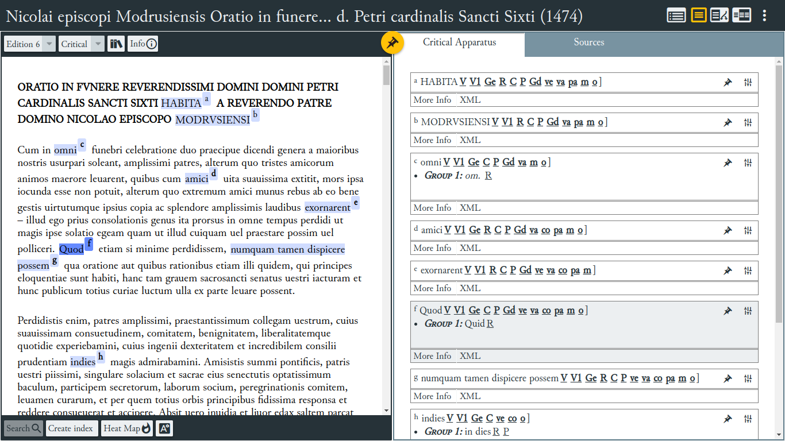

# Nicolai episcopi Modrusiensis Oratio in funere reverendissimi domini d. Petri cardinalis Sancti Sixti (1474), a digital scholarly edition

Prepared by [Neven Jovanović](orcid.org/0000-0002-9119-399X), Department of Classical Philology, [Faculty of Humanities and Social Sciences, University of Zagreb](https://www.wikidata.org/wiki/Q3445232).

A proposal for a [LDLT RSA edition](https://digitallatin.org/library-digital-latin-texts)

## Author and title of the text to be edited

Nicolai episcopi Modrusiensis Oratio in funere reverendissimi domini d. Petri cardinalis Sancti Sixti (1474)

### Description

After January 18, 1474 Nicholas (1427–1480), bishop of Modruš in Croatia, composed in Rome an oration for the cardinal priest of St Sixtus Pietro Riario (1445 – 5 January 1474), a nephew of Pope Sixtus IV. Nicholas' *Oratio in funere reverendissimi domini d. Petri cardinalis Sancti Sixti* is known from seven editions printed during the papacy of Sixtus IV, and from six more manuscript copies. The number of witnesses (and the fact that three editions were published after the author's death in 1480) suggests that the oration was a popular example of the funeral rhetoric, and of praising cardinals, in Rome under Sixtus IV.

## Files in this repository (parts of the edition)

1. The main edition file, containing the text and variant readings, apparatus of sources, introduction conformant to the [LDLT schema](https://digitallatin.github.io/guidelines/LDLT-Guidelines.html): [data/nicolausmodrusiensis.oratioriario.croala-ldlt.xml](https://github.com/nevenjovanovic/modruski-ldlt/blob/main/data/nicolausmodrusiensis.oratioriario.croala-ldlt.xml)
2. The text segmented into words (and interpunction), with morphological analysis: [data/morphosyntax/nicolausmodrusiensis.oratioriario.croala-ldlt.verba.xml](data/morphosyntax/nicolausmodrusiensis.oratioriario.croala-ldlt.verba.xml)
3. The segmented text with lemmata and references to the LiLa LemmaBank: [data/morphosyntax/nicolausmodrusiensis.oratioriario.croala-ldlt.verba.lemmata.xml](data/morphosyntax/nicolausmodrusiensis.oratioriario.croala-ldlt.verba.lemmata.xml)

## Brief survey of existing editions

After the 1480s, the oration for Riario was first published in 2005 (edited by Neven Jovanović), as part of the digital collection Croatiae auctores Latini (current URL: <http://croala.ffzg.unizg.hr/cgi-bin/navigate.pl?croala.67>). The text was based on the incunable printed by Stephanus Plannck in Rome in 1482, which seems to be the edition best preserved in libraries around the world (cf. <http://www.gesamtkatalogderwiegendrucke.de/docs/M26709.htm>).

The CroALa 2005 edition was a base for two further versions: 
+ Cook, B., & DeSilva, J. M. (2018). Princely Ambiguity: A Translation of Nikolaus of Modruš’ Funeral Oration for Cardinal Pietro Riario: Oratio in
funere Petri Cardinalis Sancti Sixti (1474). *Royal Studies Journal*, 5(2), 92–128. <http://doi.org/10.21039/rsj.152>
+ an ongoing edition by Neven Jovanović, published through Github and Zenodo, modruski-temrezah (DOI: <http://doi.org/10.5281/zenodo.3552475>, prepared in the framework of the TeMrežaH research project, PI Lahorka Plejić Poje, University of Zagreb), where it and it is being enhanced by further collations, transcriptions and comments.

The edition by Cook and DeSilva is not a digital edition (it was only typeset and distributed digitally as PDF). Both the CroALa edition and the modruski-temrezah edition are encoded as TEI XML, and both are freely accessible and reusable through respective Github repositories, but they do not match the LDLT schema. The 2005 edition lacks a full collation, and the modruski-temrezah edition encodes each witness (and further commentaries) in a separate file. Moreover, the modruski-temrezah edition is at the moment a set of files without an interface; it is more a repository of working materials than a completed edition.

## Justification of a new critical edition

The edition prepared here aims to combine the edition text, a full collation of textual witnesses with readings tagged for analysis, an identification of quotations which would be fuller than any published until now, a short historical commentary, and a lexical and grammatical commentary using the [ALDT schema morphological codes](https://github.com/alpheios-project/arethusa-configs/blob/master/configs/arethusa.morph/lat_attributes.json) and links to the [LiLa Lemma Bank](https://github.com/CIRCSE/LiLa_Lemma-Bank). Additionally, the edition will have an introduction and the apparatus fontium.

We intend to process the XML file to prepare a set of *indices* of variant readings, words, and quotations. Together with a thematic overview of the oration, the indices would present an alternative way to approach the text.

## Plan for implementing features of the LDLT's encoding guidelines

1. transfer the collation to a single file conformant to the [LDLT schema](https://digitallatin.github.io/guidelines/LDLT-Guidelines.html) -- DONE
2. add analysis of readings according to the LDLT schema -- DONE
3. translate into Latin the editorial matter and encode it in the edition file according to the LDLT schema; the editoral matter includes:
   1. the [introduction](accessoria/praefatio.md)
   2. the textual notes - DONE
   3. the historical notes
   3. the thematic outline
   4. apparatus fontium and parallel passages (selected)
4. work with the Editorial Board and the DLL staff to solve the problem of [referring to specific passages in the paragraph from the apparatus fontium](accessoria/apparatus-fontium.md)
4. work with the Editorial Board and the DLL staff to develop a way of including grammatical and lexical commentary in the encoding (as attributes of the 'w' tags and using the ALDT treebank schema and the LiLa Lemma Bank references) -- IN PROGRESS
5. prepare the indices using XSLT and XQuery transformations

For the front matter, textual commentary, and appendices of the proposed edition I intend to use Latin.

Here is a screenshot of the edition in a test run using the excellent [EVT 2 viewer](http://evt.labcd.unipi.it/).

The test run is live at our CroALa server:  [croala.ffzg.unizg.hr/modrusiensis-oratio/](http://croala.ffzg.unizg.hr/modrusiensis-oratio/).

## License

[CC-BY](LICENSE.md)
